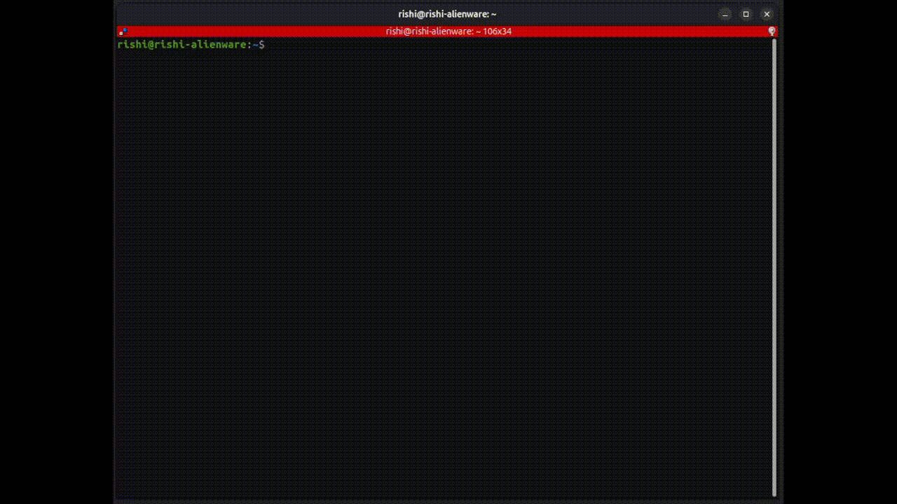
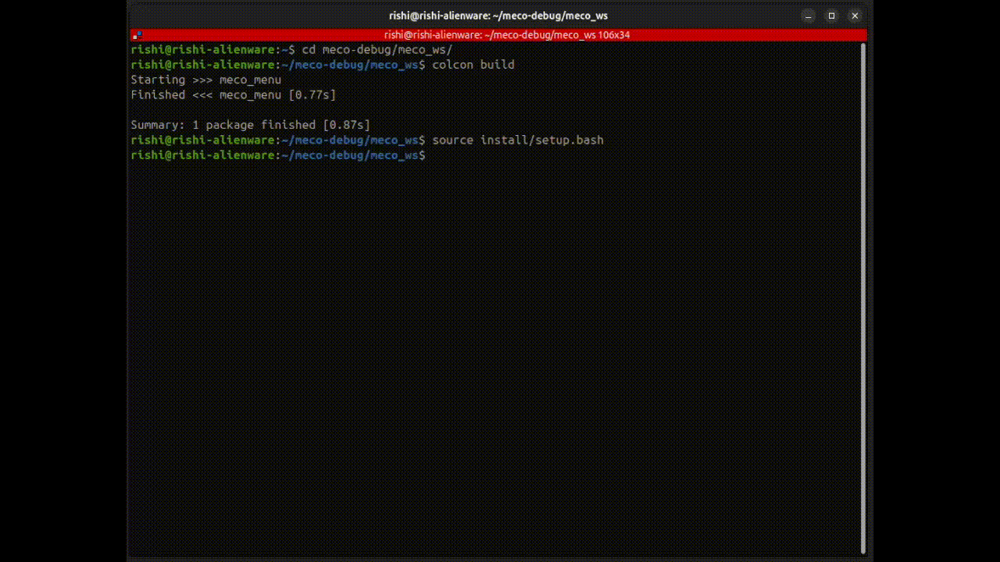
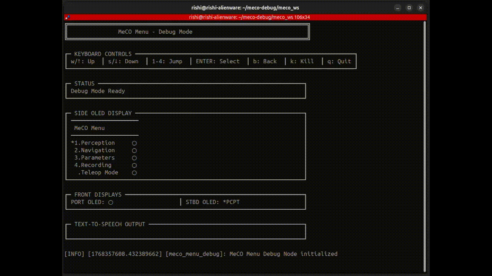
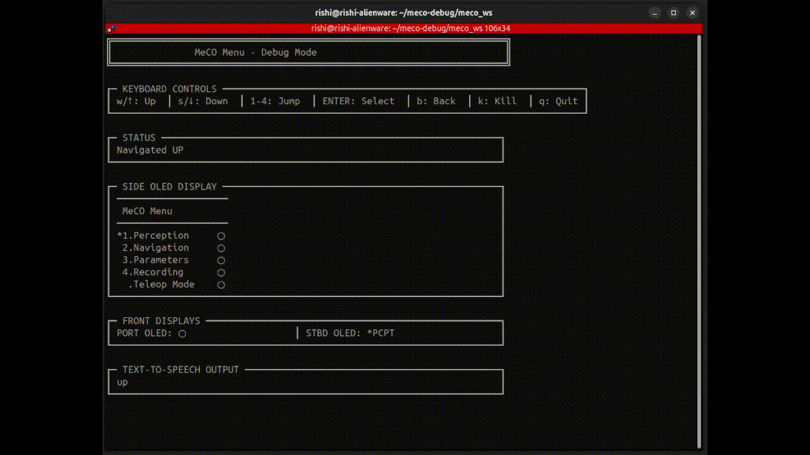
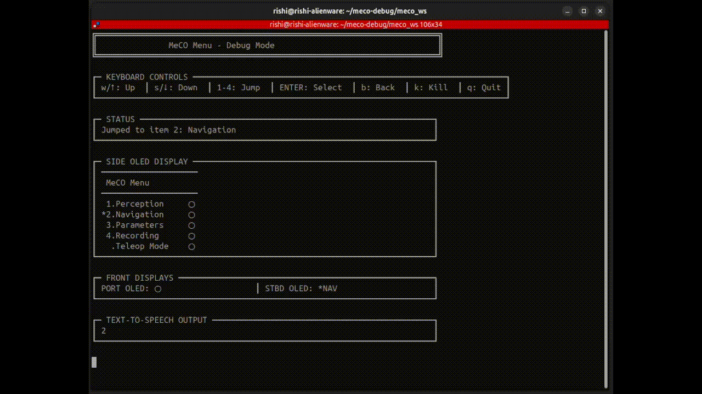
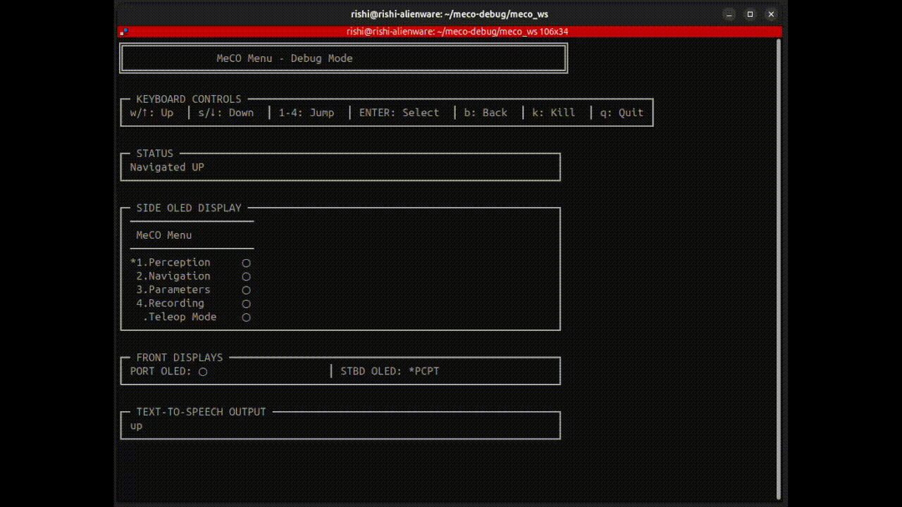

# MeCO Menu System - ROS2 Package

Hierarchical menu system for ROV operations with gesture-based navigation and process management.

## Package Structure

```
meco_ws/
└── src/
    └── meco_menu/
        ├── config/
        │   └── menu.yaml          # Menu configuration
        ├── launch/
        │   └── menu.launch.py     # Launch file
        ├── meco_menu/
        │   ├── __init__.py
        │   ├── menu.py            # Menu classes
        │   ├── processes.py       # Process management
        │   ├── menu_node.py       # Production ROS2 node
        │   └── menu_node_debug.py # Debug terminal node
        ├── resource/
        │   └── meco_menu          # Resource marker
        ├── package.xml
        ├── setup.py
        └── setup.cfg
```

## Dependencies

### System Dependencies
- ROS2 (Jazzy on development machine, Humble on meco)
- Python 3
- python3-yaml

### ROS2 Dependencies
- rclpy
- std_msgs

Install dependencies:
```bash
# On Ubuntu with ROS2 Jazzy
sudo apt install python3-yaml

# ROS dependencies are installed via rosdep
```

## Building the Workspace

### First Time Setup

```bash
# Navigate to workspace
cd meco_ws

# Install dependencies
rosdep install --from-paths src --ignore-src -r -y

# Source ROS2 (Jazzy for development)
source /opt/ros/jazzy/setup.bash

# Build the package
colcon build --packages-select meco_menu

# Source the workspace
source install/setup.bash
```

### Rebuilding After Changes

```bash
cd meco_ws

# Clean build (recommended after major changes)
rm -rf build/ install/ log/
colcon build --packages-select meco_menu

# Or incremental build
colcon build --packages-select meco_menu

# Source the workspace
source install/setup.bash
```

### Build for Humble (on meco)

```bash
# On meco robot with ROS2 Humble
cd meco_ws
source /opt/ros/humble/setup.bash
colcon build --packages-select meco_menu
source install/setup.bash
```

## Running the Nodes

### Production Mode (with hardware/topics)

```bash
# Source the workspace
source install/setup.bash

# Run the menu node
ros2 run meco_menu menu_node

# Or use the launch file
ros2 launch meco_menu menu.launch.py
```

### Debug Mode (terminal UI)

```bash
# Source the workspace
source install/setup.bash

# Run the debug node
ros2 run meco_menu menu_node_debug

# The debug node will display a terminal UI with keyboard controls:
# w/↑: Up, s/↓: Down, 1-4: Jump, ENTER: Select, b: Back, k: Kill, q: Quit
```

### With Custom Config

```bash
# Use a different menu configuration
ros2 run meco_menu menu_node --ros-args -p config_file:=/path/to/custom_menu.yaml

# Or with launch file
ros2 launch meco_menu menu.launch.py menu_config:=/path/to/custom_menu.yaml
```

## Step-by-Step Video Guide

### 1. Building the Workspace
Build and source the workspace:



<p align="center"><em>Build and Source the Workspace.</em></p>


### 2. Launching the TUI



<p align="center"><em>Start the debug menu interface.</em></p>

### 3. Navigation
Navigate up/down through menu items:



<p align="center"><em>Up and Down Navigation.</em></p>

### 4. Quick Jump
Jump directly to menu items 1-4:



<p align="center"><em>Jump to Selection.</em></p>

### 5. Error Handling



<p align="center"><em>Back Button and Error Recovery.</em></p>

### 6. Safe Kill
Safely terminate running processes:



<p align="center"><em>Killing a process.</em></p>

## Testing

### Quick Test (without ROS topics)

```bash
# Run debug node to test menu structure and navigation
ros2 run meco_menu menu_node_debug

# Navigate using keyboard:
# - w/s or arrows to navigate
# - 1-4 to quick-jump
# - ENTER to select
# - b to go back
# - k to kill all processes
# - q to quit
```

### Test with ROS Topics

In Terminal 1:
```bash
ros2 run meco_menu menu_node_debug
```

In Terminal 2:
```bash
# Monitor OLED displays
ros2 topic echo /meco/oled_menu

# Or monitor TTS
ros2 topic echo /meco/tts

# Send navigation commands
ros2 topic pub --once /menu_navigate std_msgs/Int8 "data: 1"  # Up
ros2 topic pub --once /menu_navigate std_msgs/Int8 "data: 2"  # Down
ros2 topic pub --once /menu_jump std_msgs/Int8 "data: 2"       # Jump to item 2
ros2 topic pub --once /menu_select std_msgs/Int8 "data: 1"     # Select
ros2 topic pub --once /interrupt_flag std_msgs/Int8 "data: 99" # Kill all
```

## Customizing the Menu

Edit `config/menu.yaml` to customize your menu structure.

### Menu Configuration Format

```yaml
version: 1

settings:
  max_depth: 2
  display_width: 20

label: MeCO Menu
display_side: MeCO Menu
display_f_stbd: MENU
display_f_port: ""

menu:
  - id: my_submenu
    label: My Submenu
    display_side: My Submenu
    display_f_stbd: SUBM
    display_f_port: ""
    type: submenu
    children:
      - id: my_process
        label: My Process
        display_side: My Process
        display_f_stbd: PROC
        display_f_port: ""
        type: node                    # or: docker, ros_command, command
        package: my_package
        executable: my_node
        use_launch: false
```

### Process Types

1. **docker** - Run Docker containers
   ```yaml
   type: docker
   container_name: my_container
   image: my_image:latest
   command: "ros2 launch ..."
   flags: "--network host --rm"
   gpu: true
   ```

2. **node** - ROS2 nodes
   ```yaml
   type: node
   package: package_name
   executable: node_name
   arguments: "arg1:=value1"
   use_launch: false  # true for launch files
   ```

3. **ros_command** - ROS2 CLI commands
   ```yaml
   type: ros_command
   command: "ros2 param set /node_name param_name value"
   ```

4. **command** - Bash commands
   ```yaml
   type: command
   command: "echo 'Hello World'"
   duration: 5  # Optional timeout in seconds
   ```

After modifying `menu.yaml`:
```bash
# Rebuild to install the new config
colcon build --packages-select meco_menu
source install/setup.bash

# Or manually copy to install directory
cp config/menu.yaml install/meco_menu/share/meco_menu/config/
```

## Topics

### Subscribed Topics
- `/menu_select` (std_msgs/Int8) - Select current item
- `/menu_navigate` (std_msgs/Int8) - Navigate (1=up, 2=down, 3=back)
- `/menu_jump` (std_msgs/Int8) - Quick jump to items 1-4
- `/interrupt_flag` (std_msgs/Int8) - Kill all (data=99)
- `/stop_bag` (std_msgs/Int8) - Stop bag recording (data=50)

### Published Topics
- `/meco/oled_menu` (std_msgs/String) - Side OLED display
- `/meco/oled_port` (std_msgs/String) - Front port OLED
- `/meco/oled_stbd` (std_msgs/String) - Front starboard OLED
- `/meco/tts` (std_msgs/String) - Text-to-speech output

## Troubleshooting

### Package not found
```bash
# Make sure you sourced the workspace
source install/setup.bash

# Check if package is built
ros2 pkg list | grep meco_menu
```

### Cannot find config file
```bash
# Check the install directory
ls install/meco_menu/share/meco_menu/config/

# If missing, rebuild
colcon build --packages-select meco_menu --symlink-install
```

### Import errors
```bash
# Make sure Python path is correct
python3 -c "from meco_menu import menu"

# If fails, rebuild and source
colcon build --packages-select meco_menu
source install/setup.bash
```

### Processes not starting
- Check Docker is running (for docker type processes)
- Verify ROS2 packages exist (for node type processes)
- Check the command in debug mode to see exact command being run

## Development Workflow

1. **Edit code** in `src/meco_menu/meco_menu/`
2. **Rebuild**: `colcon build --packages-select meco_menu`
3. **Source**: `source install/setup.bash`
4. **Test**: `ros2 run meco_menu menu_node_debug`

For faster iteration during development:
```bash
# Use symlink install (changes to Python files don't require rebuild)
colcon build --packages-select meco_menu --symlink-install

# Then you only need to source, not rebuild for Python changes
source install/setup.bash
```

## Transferring to meco Robot

```bash
# On development machine
cd meco_ws
tar -czf meco_menu.tar.gz src/meco_menu

# Copy to robot
scp meco_menu.tar.gz user@meco:~/

# On robot (with ROS2 Humble)
ssh user@meco
cd ~/meco_ws/src
tar -xzf ~/meco_menu.tar.gz
cd ~/meco_ws
source /opt/ros/humble/setup.bash
colcon build --packages-select meco_menu
source install/setup.bash
```

## Integration with MeCO System

The meco-menu package is designed to be integrated into the larger meco workspace:

```
meco/
├── src/
│   ├── meco_menu/          # This package
│   ├── meco_perception/
│   ├── meco_navigation/
│   └── ...
```

Simply place the `meco_menu` directory in your meco workspace's `src/` folder and build as normal.

## License

MIT
